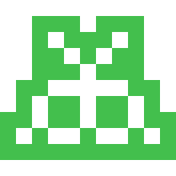

## ⚠️ Zilch has not been publicly released yet and you will not be able to download it unless you are part of the closed beta program. ⚠️

 
 

    

 
<h1 align="center">Mighty Moth</h1>

<b>This is a Zilch bot</b> · <b>Game</b> <a href="https://zilch.dev/games/tic-tac-toe">Tic-Tac-Toe</a> · <b>Language</b> <a href="https://zilch.dev/languages/python">Python</a> Ticking all the Tacks with only its Toes. 

 

## How to Play this Bot

1. [Download Zilch](https://zilch.dev/download) and start a new game of Tic-Tac-Toe
2. Navigate to shared bot selection (Select Bot → Shared Bot)
3. Paste the URL of this page into the input and load the bot

## What is Zilch?

Zilch helps novices and experts alike level up their coding skills with a suite of engaging games. These games are played by bots - bots you think up, design, and program. Lectures and textbooks have their place, but real learning? That requires problems without prescribed solutions in the back of a book. Zilch aims to provide the best problems possible: approachable, competitive, open-ended, fun, playable problems; problems won with the bots you build.

[Learn more at zilch.dev](https://zilch.dev) 🚀